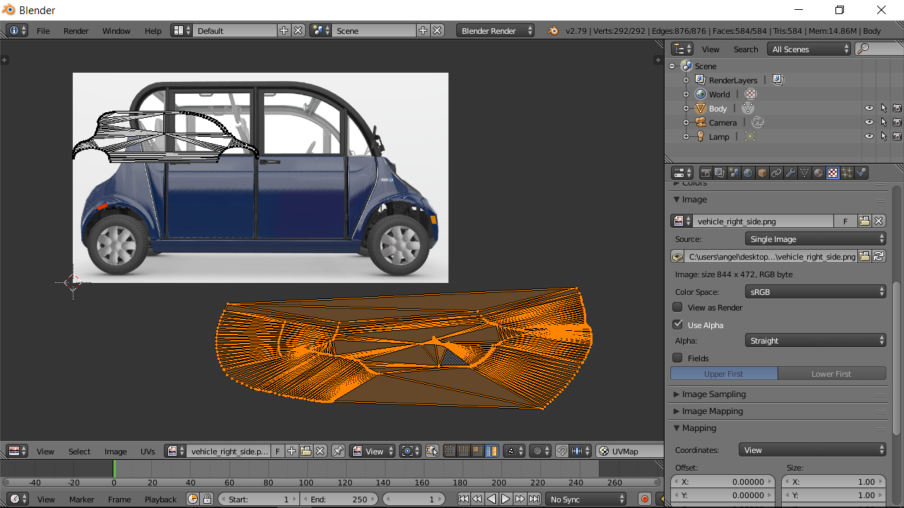

# Introduction to 3D Modeling for Gazebo / ROS

## Table of Contents

- [Introduction](#introduction)
- [Making the model in fusion](#making-the-model-in-fusion)
    - [Finding a suitable photo](#finding-a-suitable-photo)
    - [Getting set up in Fusion](#getting-set-up-in-fusion)
    - [Bringing the photo into Fusion](#bringing-the-photo-into-fusion)
    - [Sketching the vehicle](#sketching-the-vehicle)
        - [Sketching straight lines](#sketching-straight-lines)
        - [Sketching arcs](#sketching-arcs)
        - [Sketching complex curves](#sketching-complex-curves)
    - [Extruding a solid model](#extruding-a-solid-model)
    - [Exporting to STL for Blender](#exporting-to-stl-for-blender)
- [Texturing the model in Blender](#texturing-the-model-in-blender)
    - [Importing the STL into Blender](#importing-the-stl-into-blender)
    - [Creating a texture](#creating-a-texture)
    - [Unwrapping and UV mapping](#unwrapping-and-uv-mapping)
        - [Marking seams](#marking-seams)
        - [UV mapping](#uv-mapping)
    - [Export to OBJ for Gazebo/ROS](#export-to-obj-for-gazeboros)

## Introduction

The 3D model you see in the screenshot above was made when we needed a quick and dirty model for use in Gazebo and ROS. It's certainly not the most beautiful model, but it was made very quickly, has roughly accurate dimensions, and it looks enough like our actual vehicle that it won't be mistaken for anything else.

This tutorial will guide you through the process of creating and texturing a 3D model from scratch. We assume no experience with CAD or computer graphics software. And you should be able to finish within a few hours.

The workflow will be as follows: we'll find a picture of the side profile of the vehicle, trace this picture in Fusion to create a solid model, then apply graphics to that model in Blender.

We'll be using the following tools:
- Fusion 360 (v2.0.3803) - computer aided design software (autodesk.com/products/fusion-360)
- Blender (v2.79) - computer graphics software (blender.org)

## Making the model in Fusion

### Finding a suitable photo

An ideal picture for this purpose should show one side of the car being as close to normal to the camera as possible. To avoid perspective effects you should also avoid close up, wide-angle, type photos. If you're taking a photo yourself, this means line up perpendicular to the side of the car, stand far away, and use lots of zoom.

For this tutorial, we'll be using a screenshot from our vehicle's website.

### Getting set up in Fusion
When you open Fusion, there should be an empty project open. All we need to do is change the units to meters, since that's what's expected in Gazebo. In the *Browser*, expand *Document Settings*, click on the edit button that appears when you hover over *Units*, change the units to *Meter*, and click *OK*.

### Bringing the photo into Fusion

We'll bring the photo into Fusion using the *attached canvas* feature. This will paste the photo on a plane allowing us to sketch over it. Begin by clicking the attached canvas button.

Click on the XY plane, then click the *Select Image* button, and select the image you found of your vehicle. For this tutorial we are using [resources/vehicle_right_side.png](resources/vehicle_right_side.png). After selecting the image, click *OK*.

We will now scale the image by selecting two points on it and inputting the real distance between them. In our case we'll click on the center of both wheels and input the wheelbase, a number that is available online for most vehicles.

Begin by expanding the *Canvases* folder in the *Browser*, right clicking on our canvas, and clicking *Calibrate*. Then click *Front* on the view cube in the top right corner. This will make the view normal to our canvas.

Note: you can zoom with the mouse wheel and pan with Ctrl+middle click.

Click on the center of both wheels, input the wheelbase, and press Enter.

The last step is to move the image so that the model's origin is in a meaningful place. In vehicle models it is conventional to place the origin at the center of the rear axle, so we'll line up the origin at the center of the rear wheel.

Begin by right clicking on our canvas in the *Browser* and clicking *Edit Canvas*.

Drag the arrows to move the image and line up the center of the rear wheel with the origin (where the red and green lines intersect). You can also rotate the image now if necessary, but be careful not to scale it. When you are satisfied with the position of the image, click *OK*.

### Sketching the vehicle

Now that our image is in Fusion, we can sketch over it to define the shape of our solid model. Create a new sketch by clicking the *Create Sketch* button, then clicking on the XY plane.

Use the sketching tools described below to trace the body of the vehicle until you have an enclosed profile.

#### Sketching straight lines

To sketch a straight line, click the *Line* button, then click the start and end points of your lines. Click the check mark when you are done.

#### Sketching arcs

To sketch an arc of constant radius, click *Sketch* > *Arc* > *3-point Arc*, then click the start and end points of your arc, and finally a third point on the arc.

#### Sketching complex curves

To sketch a complex curve, click *Sketch* > *Spline*, then click the start and end points of your curve, and click the check mark. Press Esc to deselect the spline tool, then move the green dots on both ends of the curve to get the desired shape.

### Extruding a solid model

Now that we have an enclosed profile in our sketch, we can extrude it to create a solid model. To do this, click the *Extrude* button, click inside the vehicle profile on the sketch, change *Direction* to *Two Sides*, and set both *Distance*s to half the vehicle width, then click *OK*.

Using the same techniques already described, you can do an *extruded cut* to form the windows. For simplicity, in this tutorial we'll only create one window. See the animation below to see how simply this can be done.

### Exporting to STL for Blender

When you are satisfied with your model, it is ready to be exported for blender. To export, right click on your project in the *Browser* and click *Save As STL*. Set *Format* to *Binary* and *Refinement* to *Low*. Click *OK* and save the file wherever you'd like. For this tutorial, this file is located at [resources/body.stl](resources/body.stl).

## Texturing the model in Blender

When you open Blender the first thing you’ll want to do is delete the cube that is placed in the default project.Right click the word *Cube* in the project Outliner window on the right and click *Delete*. Deleting the lamp is also a good idea as it will help to see the texture on the model.

### Importing the STL into Blender

Import the STL file by clicking *File* > *Import* > *Stl*.

In the import settings, change *Forward:* to *-Z Forward* and *Up:* to *Y Up*.

Note: the setting above apply if you were using the default settings in Fusion. You may need to tweak these if your vehicle isn't facing in the +X direction like so.

### Creating a texture

Before applying graphics to our model we'll need to create a texture. Click the texture tab on the toolbar on the right, and click *New*.

Scroll down to the image section, click *Open*, and select the image file we used to create our model (in this tutorial, [resources/vehicle_right_side.png](resources/vehicle_right_side.png)).

### Unwrapping and UV mapping

In order to apply 2D graphics to our 3D model we will have to unwrap it. To understand this process, imagine that our model is covered in fabric and that we are cutting and unwrapping the fabric so we can lay it flat and paste 2D graphics over it.

This is what unwrapping looks like for a simple cube.

For a more detailed explanation of how this works, you can find many resources online, such as these:  
http://sophiehoulden.com/tutorials/blender/unwrapTut.html  
https://www.youtube.com/watch?v=scPSP_U858k

#### Marking seams

The first step in the unwrapping process is to mark all the seams, the edges where we can *cut*. To do this, first enter Edit Mode in the 3D view of your model.

Then switch to Edge select mode.

Now we can begin marking seams. First press *A* on the keyboard to deselect everything. Right click on an edge to select it (hold shift to select multiple), then click Mark Seam on the Shading / UVs tab on the toolbar on the left.

When an edge is marked as a seam it will become red.

For the purpose of this tutorial we will demonstrate this process for the right side of the car. We'll just need to mark enough seams to cut this side out and separate it from the rest of the model, creating an island. This means marking seams along the perimeter of this side, as well as the inner perimeter of the window.

#### UV mapping

Once the seams on this side are marked we’re ready to unwrap it. For simplicity, select everything by pressing *A*, then click *Unwrap* from the *Unwrap* drop-down menu in the *Shading / UVs* tab on the toolbar on the left.

Note: after you’ve done the UV mapping for this side be careful not to unwrap it again by selecting and unwrapping the whole model or your work will be undone.

To see the results of the unwrapping, change the editor type of the large view by clicking the Editor Type button and selecting UV/Image Editor.

The results should look like this. Notice that the side that we marked seams on is clearly visible as an island, while the rest of the mesh looks like a mess when flattened.

We will now tell Blender to use our image of the car to map graphics onto this geometry by clicking the image icon below and clicking on our image in the list.

Press *A* to deselect everything, then switch to Island selection mode.

Right click on the island on the right to select it, press *G* to move it off the image, then left click to confirm.

Right click on the other island and manipulate it to fit it nicely over the image using the techniques described below.
 - Press *G* to move the island.
 - Press *S* to scale the island.
 - Press *R* to rotate the island.
 - While moving or scaling you can press *X* or *Y* to transform about that axis only, and you can hold *Shift* to make fine adjustments.

 

To see the results, return to the 3D view, change to *Object Mode*, and change to *Texture* display mode.

Using these techniques you should be able to texture the entire car. Simply create a composite image containing all the faces of the car, unwrap the mesh into several islands, and map those islands to the faces of the car in the image.

### Export to OBJ for Gazebo/ROS

When you are satisfied with your model, it can be exported into a format which can be used in ROS and Gazebo. This will output an obj file, an mtl file, and a copy of your texture image. To do this click on *File* > *Export* *Wavefront (.obj)*.

In the export settings, change *Forward:* to *Y Forward*, and *Up:* to *Z Up*.

Scroll down and change *Path Mode:* to *Copy*.

Then choose an appropriate location and file name, click Export OBJ, and you’re done! With these files, you can now use your model in ROS and Gazebo, although that process is not covered by this tutorial (yet).